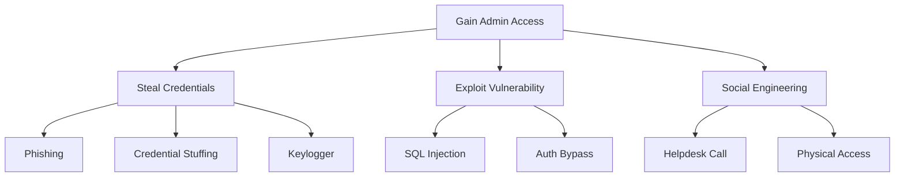

Attack trees are a visual methodology for analyzing how an attacker might achieve a goal. Invented by Bruce Schneier, they provide a structured way to think through all possible attack paths—helping you identify threats that might be missed with linear analysis.

Unlike STRIDE (which categorizes threats) or DREAD (which prioritizes them), attack trees show **how** attacks happen. The tree structure makes complex attack scenarios understandable and helps identify the weakest links in your defenses.

## Anatomy of an Attack Tree

An attack tree consists of:

- **Root node**: The attacker's ultimate goal
- **Child nodes**: Sub-goals or steps needed to achieve the parent
- **Leaf nodes**: Atomic attack actions
- **AND/OR gates**: How sub-goals combine

### Basic Structure

```
                    [Attacker Goal]
                          |
            +-------------+-------------+
            |                           |
       [Sub-goal A]               [Sub-goal B]
            |                           |
      +-----+-----+               +-----+-----+
      |           |               |           |
   [Step 1]   [Step 2]       [Step 3]   [Step 4]
```

- **OR relationship** (default): Attacker needs to complete ANY child to achieve parent
- **AND relationship**: Attacker must complete ALL children to achieve parent

## Building Your First Attack Tree

Let's model a common scenario: compromising a web application's admin account.

### Step 1: Define the Root Goal

Start with a clear, specific attacker objective:

```
Goal: Gain Admin Access to Web Application
```

### Step 2: Identify High-Level Approaches

What are the main ways to achieve this goal?

```
                    [Gain Admin Access]
                           |
         +-----------------+------------------+
         |                 |                  |
   [Steal Admin      [Exploit App      [Social Engineer
    Credentials]      Vulnerability]    Admin User]
```

### Step 3: Decompose Each Approach

Break down each high-level approach into specific attack vectors:

```
                         [Gain Admin Access]
                                |
         +----------------------+----------------------+
         |                      |                      |
   [Steal Admin           [Exploit App           [Social Engineer
    Credentials]           Vulnerability]         Admin User]
         |                      |                      |
    +----+----+            +----+----+            +----+----+
    |         |            |         |            |         |
 [Phishing] [Keylogger] [SQLi]  [Auth     [Pretexting] [Baiting]
                                 Bypass]
```

### Step 4: Continue Until Atomic Actions

Expand until you reach actions that can't be meaningfully decomposed:

```
[Phishing]
    |
+---+---+
|       |
[Send   [Clone
 Email]  Login Page]
   |         |
   |    +----+----+
   |    |         |
   |  [Buy    [Setup
   |   Domain] Hosting]
   |
+--+---+
|      |
[Craft [Buy Victim
 Lure]  Email List]
```

## Attack Tree Notation

### Text-Based Notation

For documentation and code reviews, use indented text:

```
Goal: Gain Admin Access
 OR
 |-- Steal Credentials
 |   OR
 |   |-- Phishing Attack
 |   |   AND
 |   |   |-- Create Fake Login Page
 |   |   |-- Send Convincing Email
 |   |   |-- Victim Enters Credentials
 |   |
 |   |-- Credential Stuffing
 |   |   AND
 |   |   |-- Obtain Leaked Password List
 |   |   |-- Admin Reuses Password
 |   |
 |   |-- Keylogger
 |       AND
 |       |-- Install Malware on Admin Machine
 |       |-- Admin Logs In
 |
 |-- Exploit Vulnerability
 |   OR
 |   |-- SQL Injection
 |   |   AND
 |   |   |-- Find Injectable Parameter
 |   |   |-- Extract Admin Password Hash
 |   |   |-- Crack Hash
 |   |
 |   |-- Authentication Bypass
 |       OR
 |       |-- JWT Algorithm Confusion
 |       |-- Session Fixation
 |
 |-- Social Engineering
     OR
     |-- Call IT Helpdesk
     |   AND
     |   |-- Impersonate Employee
     |   |-- Request Password Reset
     |
     |-- Physical Access
         AND
         |-- Tailgate into Office
         |-- Access Unlocked Workstation
```

### YAML Notation for Tooling

```yaml
attack_tree:
  goal: "Gain Admin Access"
  type: OR
  children:
    - name: "Steal Credentials"
      type: OR
      children:
        - name: "Phishing Attack"
          type: AND
          cost: 500
          skill: 3
          children:
            - name: "Create Fake Login Page"
              leaf: true
              cost: 100
            - name: "Send Convincing Email"
              leaf: true
              cost: 50
            - name: "Victim Enters Credentials"
              leaf: true
              probability: 0.15
        
        - name: "Credential Stuffing"
          type: AND
          cost: 200
          children:
            - name: "Obtain Leaked Password List"
              leaf: true
              cost: 100
            - name: "Admin Reuses Password"
              leaf: true
              probability: 0.3
    
    - name: "Exploit Vulnerability"
      type: OR
      children:
        - name: "SQL Injection"
          type: AND
          skill: 5
          children:
            - name: "Find Injectable Parameter"
              leaf: true
              time_hours: 4
            - name: "Extract Admin Hash"
              leaf: true
            - name: "Crack Password Hash"
              leaf: true
              time_hours: 24
```

## Annotating Attack Trees

Add attributes to nodes to enable quantitative analysis:

### Common Attributes

| Attribute | Description | Example Values |
|-----------|-------------|----------------|
| **Cost** | Resources needed (money, time) | $100, 4 hours |
| **Skill** | Technical expertise required | 1-10 scale |
| **Probability** | Likelihood of success | 0.0 - 1.0 |
| **Detectability** | Chance of being caught | Low/Medium/High |
| **Prerequisites** | What must happen first | "Network access" |

### Annotated Example

```python
# Python representation for automated analysis
attack_tree = {
    'goal': 'Gain Admin Access',
    'type': 'OR',
    'children': [
        {
            'name': 'Phishing',
            'type': 'AND',
            'cost_usd': 500,
            'time_hours': 8,
            'skill_level': 3,
            'success_probability': 0.15,
            'detection_probability': 0.4,
            'children': [
                {'name': 'Setup fake domain', 'leaf': True, 'cost_usd': 15},
                {'name': 'Clone login page', 'leaf': True, 'time_hours': 2},
                {'name': 'Craft email', 'leaf': True, 'time_hours': 1},
                {'name': 'Victim clicks link', 'leaf': True, 'probability': 0.3}
            ]
        },
        {
            'name': 'SQL Injection',
            'type': 'AND',
            'cost_usd': 0,
            'time_hours': 12,
            'skill_level': 6,
            'success_probability': 0.8,  # If vuln exists
            'detection_probability': 0.6,
            'prerequisites': ['Vulnerable endpoint exists'],
            'children': [
                {'name': 'Find injectable param', 'leaf': True},
                {'name': 'Extract hash', 'leaf': True},
                {'name': 'Crack hash', 'leaf': True, 'time_hours': 24}
            ]
        },
        {
            'name': 'Insider Threat',
            'type': 'AND',
            'cost_usd': 10000,  # Bribe
            'skill_level': 1,
            'success_probability': 0.9,
            'detection_probability': 0.2,
            'children': [
                {'name': 'Identify disgruntled employee', 'leaf': True},
                {'name': 'Make offer', 'leaf': True},
                {'name': 'Employee provides access', 'leaf': True}
            ]
        }
    ]
}
```

## Analyzing Attack Trees

### Finding the Cheapest Attack Path

For OR nodes, take the minimum cost child. For AND nodes, sum all children:

```python
def calculate_min_cost(node):
    """Calculate minimum cost to achieve this node."""
    if node.get('leaf'):
        return node.get('cost_usd', 0)
    
    child_costs = [calculate_min_cost(child) for child in node['children']]
    
    if node['type'] == 'OR':
        return min(child_costs)
    else:  # AND
        return sum(child_costs)

# For our example:
# - Phishing: $500 (fixed campaign cost)
# - SQL Injection: $0 (just needs skill)
# - Insider: $10,000 (bribe)
# Minimum: SQL Injection at $0
```

### Finding the Easiest Attack Path

Consider both skill and success probability:

```python
def find_easiest_path(node, current_path=None):
    """Find attack path with lowest skill requirement and highest success."""
    current_path = current_path or []
    
    if node.get('leaf'):
        return [node['name']], node.get('skill_level', 1)
    
    if node['type'] == 'OR':
        # Find child with lowest skill requirement
        best_path = None
        best_skill = float('inf')
        
        for child in node['children']:
            path, skill = find_easiest_path(child)
            if skill < best_skill:
                best_skill = skill
                best_path = [child['name']] + path
        
        return best_path, best_skill
    
    else:  # AND - must do all, take max skill
        all_paths = []
        max_skill = 0
        
        for child in node['children']:
            path, skill = find_easiest_path(child)
            all_paths.extend(path)
            max_skill = max(max_skill, skill)
        
        return all_paths, max_skill
```

### Identifying Critical Nodes

Nodes that appear in all attack paths are critical—hardening them blocks multiple attacks:

```python
def find_all_paths(node, current_path=None):
    """Generate all possible attack paths."""
    current_path = current_path or []
    
    if node.get('leaf'):
        yield current_path + [node['name']]
        return
    
    if node['type'] == 'OR':
        for child in node['children']:
            yield from find_all_paths(child, current_path + [node['name']])
    else:  # AND
        # For AND, we need all children in the path
        child_paths = [list(find_all_paths(c, [])) for c in node['children']]
        # Combine all possibilities (Cartesian product)
        from itertools import product
        for combo in product(*child_paths):
            combined = current_path + [node['name']]
            for path in combo:
                combined.extend(path)
            yield combined

def find_critical_nodes(attack_tree):
    """Find nodes that appear in ALL attack paths."""
    paths = list(find_all_paths(attack_tree))
    
    if not paths:
        return set()
    
    # Start with all nodes in first path
    critical = set(paths[0])
    
    # Intersect with all other paths
    for path in paths[1:]:
        critical &= set(path)
    
    return critical
```

## Attack Trees for Common Scenarios

### Example 1: Data Exfiltration

```
Goal: Exfiltrate Customer Database
 OR
 |-- External Attack
 |   OR
 |   |-- Exploit Public-Facing App
 |   |   AND
 |   |   |-- Find RCE Vulnerability
 |   |   |-- Establish Reverse Shell
 |   |   |-- Locate Database
 |   |   |-- Exfil via Encrypted Channel
 |   |
 |   |-- Compromise Cloud Account
 |       AND
 |       |-- Obtain AWS Keys (leaked in repo)
 |       |-- Access S3 Backup Bucket
 |       |-- Download Database Dump
 |
 |-- Insider Threat
 |   OR
 |   |-- Malicious Admin
 |   |   AND
 |   |   |-- Admin Exports Data
 |   |   |-- Transfers to Personal Device
 |   |
 |   |-- Compromised Endpoint
 |       AND
 |       |-- Malware on Employee Laptop
 |       |-- Intercept Database Credentials
 |       |-- Connect via VPN
 |       |-- Query and Exfil Data
 |
 |-- Physical Access
     AND
     |-- Gain Building Access
     |-- Find Unattended Workstation
     |-- Connect USB Device
     |-- Copy Database
```

### Example 2: Supply Chain Attack

```
Goal: Inject Malicious Code into Product
 OR
 |-- Compromise Source Repository
 |   OR
 |   |-- Steal Developer Credentials
 |   |   AND
 |   |   |-- Phish Developer
 |   |   |-- Bypass MFA (SIM swap/push fatigue)
 |   |   |-- Push Malicious Commit
 |   |
 |   |-- Compromise CI/CD Pipeline
 |       AND
 |       |-- Access Jenkins/GitHub Actions
 |       |-- Modify Build Script
 |       |-- Inject During Build
 |
 |-- Compromise Dependency
 |   OR
 |   |-- Typosquatting
 |   |   AND
 |   |   |-- Register Similar Package Name
 |   |   |-- Developer Makes Typo
 |   |
 |   |-- Compromise Legitimate Package
 |       AND
 |       |-- Take Over Maintainer Account
 |       |-- Push Malicious Update
 |
 |-- Compromise Build Infrastructure
     AND
     |-- Access Build Server
     |-- Modify Compiler/Toolchain
     |-- Inject at Compile Time
```

## Integrating Attack Trees with STRIDE/DREAD

Use all three methodologies together:

1. **STRIDE**: Categorize what types of threats exist
2. **Attack Trees**: Model how each threat could be realized
3. **DREAD**: Prioritize which attack paths to defend first

```python
# Combined threat model
threat = {
    'name': 'Admin Account Compromise',
    'stride_category': 'Spoofing / Elevation of Privilege',
    'attack_tree': attack_tree,  # From above
    'dread': {
        'damage': 9,
        'reproducibility': 7,
        'exploitability': 6,
        'affected_users': 10,
        'discoverability': 5
    },
    'analysis': {
        'cheapest_path': 'SQL Injection',
        'min_cost': 0,
        'easiest_path': 'Phishing',
        'critical_controls': [
            'MFA on admin accounts',
            'Input validation',
            'Security awareness training'
        ]
    }
}
```

## Tools for Attack Tree Modeling

### Text-Based Tools

- **PlantUML**: Generate diagrams from text
- **Mermaid**: Markdown-compatible diagrams
- **Graphviz**: Powerful graph visualization

### Mermaid Example



### Dedicated Attack Tree Tools

- **ADTool**: Academic tool for attack-defense trees
- **Threagile**: Code-based threat modeling
- **Microsoft Threat Modeling Tool**: Free GUI tool
- **OWASP Threat Dragon**: Open-source web app

## Best Practices

### Do:

- Start with a clear, specific goal
- Involve multiple perspectives (dev, ops, security)
- Update trees as the system evolves
- Focus on realistic attack scenarios
- Annotate with costs and probabilities

### Don't:

- Make trees too detailed (keep manageable)
- Forget about insider threats
- Ignore physical attack vectors
- Stop at theoretical—validate with pen testing
- Create once and never update

## Summary

Attack trees provide a visual, systematic way to model threats:

- **Root node**: What does the attacker want?
- **Child nodes**: How can they achieve it?
- **OR gates**: Attacker needs any one path
- **AND gates**: Attacker needs all sub-steps
- **Annotations**: Cost, skill, probability for analysis

Use attack trees to:

1. Discover attack paths you hadn't considered
2. Identify critical controls that block multiple paths
3. Communicate threats to non-technical stakeholders
4. Prioritize security investments

In the next section, we'll apply everything we've learned with hands-on threat modeling exercises.
